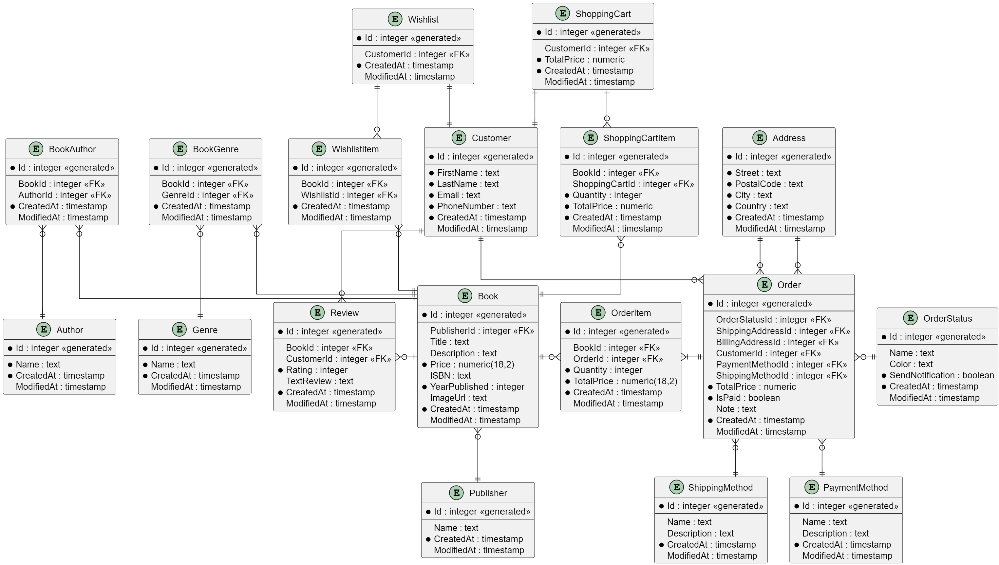
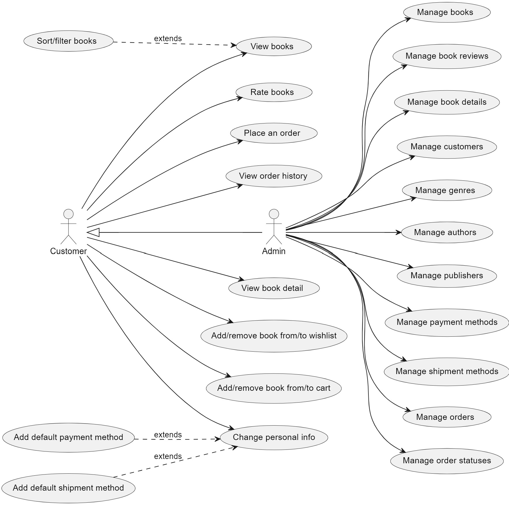

# bookhub

## Structure

- `WebAPI` - web api (controllers, middlewares)

- `WebMVC` - the website (user/admin roles, standard MVC)

- `BusinessLayer` - business layer (services, dtos, queries, coordinators)

- `DataAccessLayer` - data access layer (entities, seeding, repositories)

## Used middleware

- `ExceptionMiddleware`: catches any exception and returns a generic 500 server error message

- `LoggingMiddleware`: simple logging middleware

- `TimingMiddleware`: measures the time each request takes to process

- `TransformOutputMiddleware`: converts responses from JSON to XML if the responseFormat is set to "xml"

## Running the app

### Option 1: Docker

1. `docker compose up`
  - Creates 2 containers for WebAPI and WebMVC
  - Each service uses a separate SQLite DB

2. Visit the respective address
  - <http://localhost:5000/swagger/index.html> for WebAPI
  - <http://localhost:5001/> for WebMVC

### Option 2: Manually

1. Creating database

The default database provider is SQLite, and the database files will be created within the respective project automatically.
 
To use Postgres instead:
  - in the configuration `bookhub/src/WebAPI/appsettings.json` (`bookhub/src/WebMPC/appsettings.json`) change `DatabaseProvider` to `"PostgreSQL"`
  - (optional) change the `PostgresConnection` connection string

2. Running the app

Run the `WebMVC` project to run the "final" website, or the `WebAPI` for Swagger UI.

### Authenticating

On `WebAPI` register (or login) and then authorize on the top of the page using the returned JWT key.

On `WebMVC` create an account (or login).

For testing please use the following credentials:

- admin user

  - email: `test.admin@mail.com`
  - password: `password`

- normal user

  - email: `test.user@mail.com`
  - password: `password`

## Diagrams

### ER Diagram

    

### Use-Case Diagram

    

